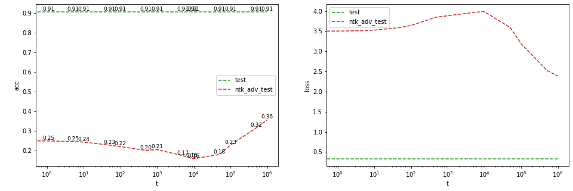
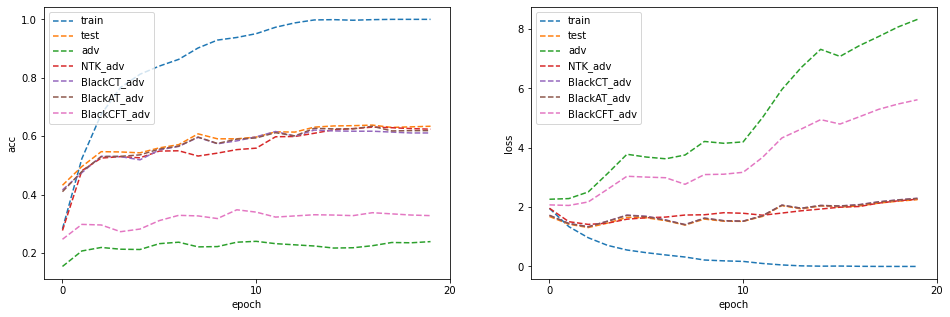
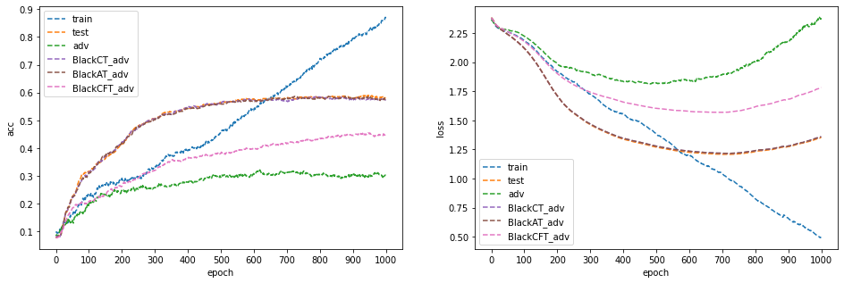

# Neural Tangent Kernel Attacks (NTK-attack)

## Overview

We propose a new adversarial black-box attack, which is different from traditional black-box attack that needs to train a substitute model and perform FGSM/PGD. We show that **NTK-attack** can get the attack success rate to a certain degree.

## Experiments

In the figure above, we show that **NTK-attack** can get the attack success rate to a certain degree, specially when the `t` is correspond to the training time of the vulnerable model.

---

We also show the comparsion between **NTK-attack** and PGD (white-box attack) on a single image random sampled from svhn-gray dataset. 

The image above in right column is PGD with $\epsilon=0.03$(L-inf) and 1k random start; the middle column is **NTK-attack**, same with $\epsilon=0.03$(L-inf) and 1k random start; the left column is the original image without perturbation. The top row is the loss while the bottom row is the output logits.

---

In jupyter files, we conduct experiments about applying **NTK-attack** to Transfer Learning. We try to use VGG model pre-trained on clean ImageNet, and fine-tune on relative small dataset. We hope using **NTK-attack** to fine-tune can get both clean accuray and robustness.

In the image above, **NTK-attack** does get both clean accuray and robustness to a certain degree, although the performance still worse than baseline: using FGSM to fine-tune, showing below.

